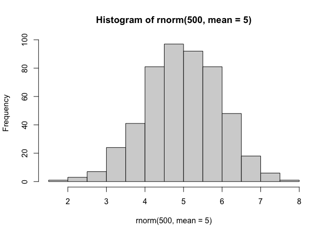
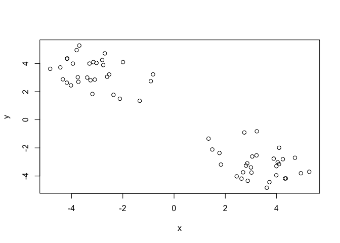
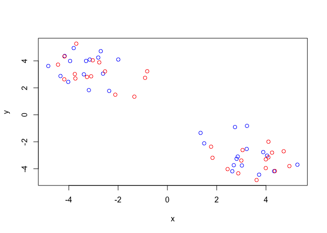
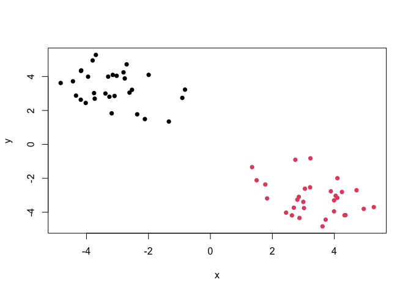
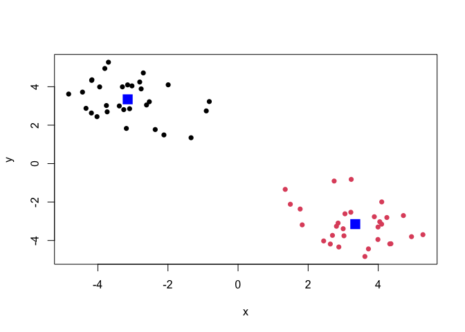
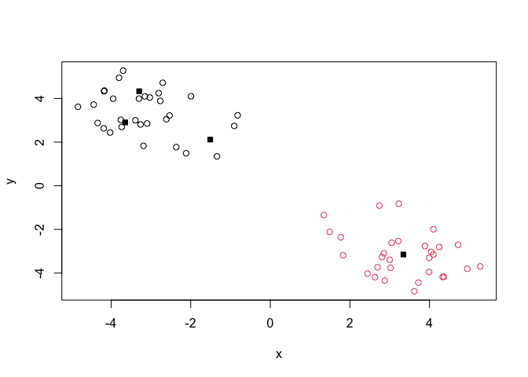
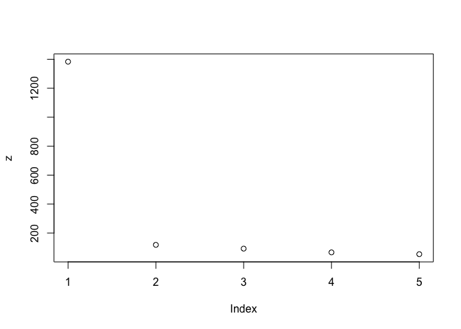
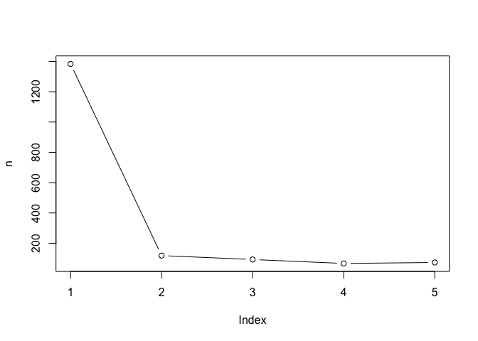
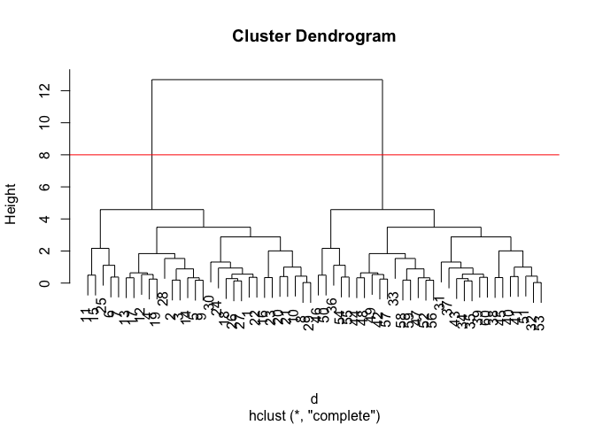
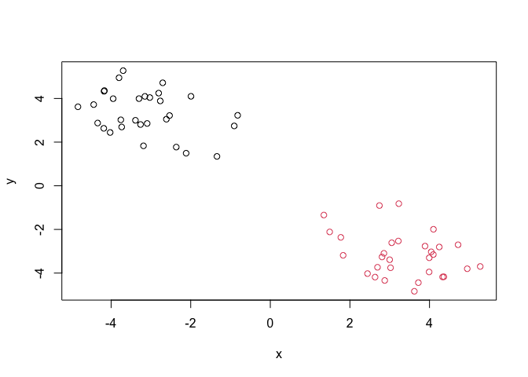

# Class 7: Machine Learning 1
Ashley Martinez (PID: A17891957)

Today we will explore some fundamental machine learning methods
including clustering and dimensionality reduction.

## K-means clustering

To see how this works let’s first makeup some data to cluster where we
know what the answer should be. We can use the ‘rnorm()’ function to
help here:

``` r
hist(rnorm(500,mean=5))
```



``` r
x<-c(rnorm(30,mean=-3), rnorm(30,mean=3))
y<-rev(x)
```

``` r
x<-cbind(x,y)
plot(x)
```



The function for K-means clustering in “base” R is ‘kmeans()’

``` r
k<-kmeans(x,centers=2)
k
```

    K-means clustering with 2 clusters of sizes 30, 30

    Cluster means:
              x         y
    1 -3.149096  3.344273
    2  3.344273 -3.149096

    Clustering vector:
     [1] 1 1 1 1 1 1 1 1 1 1 1 1 1 1 1 1 1 1 1 1 1 1 1 1 1 1 1 1 1 1 2 2 2 2 2 2 2 2
    [39] 2 2 2 2 2 2 2 2 2 2 2 2 2 2 2 2 2 2 2 2 2 2

    Within cluster sum of squares by cluster:
    [1] 59.2793 59.2793
     (between_SS / total_SS =  91.4 %)

    Available components:

    [1] "cluster"      "centers"      "totss"        "withinss"     "tot.withinss"
    [6] "betweenss"    "size"         "iter"         "ifault"      

To get the results of the returned list object we can dollar ‘\$’ syntax

> Q. How many points are in each cluster?

``` r
k$size
```

    [1] 30 30

> Q. What ‘component’ of your result object details -cluster
> assignment/membership? -cluster center?

``` r
k$cluster
```

     [1] 1 1 1 1 1 1 1 1 1 1 1 1 1 1 1 1 1 1 1 1 1 1 1 1 1 1 1 1 1 1 2 2 2 2 2 2 2 2
    [39] 2 2 2 2 2 2 2 2 2 2 2 2 2 2 2 2 2 2 2 2 2 2

``` r
k$centers
```

              x         y
    1 -3.149096  3.344273
    2  3.344273 -3.149096

> Q. Make a clustering results figure of the data colored by cluster
> membership.

``` r
plot(x,col=c("red","blue"))
```



``` r
plot(x,col=k$cluster,pch=16)
```



``` r
plot(x,col=k$cluster,pch=16)
points(k$centers,col="blue",pch=15,cex=2)
```



K-means clustering is very popular as its very fast and relatively
straight foward: it takes numeric data as input and returns the clusterm
membership vector etc.

The “issue” is we tell ‘kmeans()’ how many clusters we want!

> Q. Run kmeans again and cluster into 4 grps/clusters and plot the
> results like we did above?

``` r
k4<-kmeans(x,centers=4)
plot(x,col=k$cluster)
points(k4$centers,pch=15)
```



Screeplot to pick k ‘centers’ calue

Can do through brute force

``` r
c(k1<-kmeans(x,centers=1),
  k2<-kmeans(x,centers=2),
  k3<-kmeans(x,centers=3),
  k4<-kmeans(x,centers=4),
  k5<-kmeans(x,centers=5))
```

    $cluster
     [1] 1 1 1 1 1 1 1 1 1 1 1 1 1 1 1 1 1 1 1 1 1 1 1 1 1 1 1 1 1 1 1 1 1 1 1 1 1 1
    [39] 1 1 1 1 1 1 1 1 1 1 1 1 1 1 1 1 1 1 1 1 1 1

    $centers
               x          y
    1 0.09758863 0.09758863

    $totss
    [1] 1383.474

    $withinss
    [1] 1383.474

    $tot.withinss
    [1] 1383.474

    $betweenss
    [1] -2.273737e-13

    $size
    [1] 60

    $iter
    [1] 1

    $ifault
    NULL

    $cluster
     [1] 2 2 2 2 2 2 2 2 2 2 2 2 2 2 2 2 2 2 2 2 2 2 2 2 2 2 2 2 2 2 1 1 1 1 1 1 1 1
    [39] 1 1 1 1 1 1 1 1 1 1 1 1 1 1 1 1 1 1 1 1 1 1

    $centers
              x         y
    1  3.344273 -3.149096
    2 -3.149096  3.344273

    $totss
    [1] 1383.474

    $withinss
    [1] 59.2793 59.2793

    $tot.withinss
    [1] 118.5586

    $betweenss
    [1] 1264.915

    $size
    [1] 30 30

    $iter
    [1] 1

    $ifault
    [1] 0

    $cluster
     [1] 1 3 3 1 1 3 3 1 1 1 3 1 1 1 3 1 1 1 1 1 1 1 1 1 3 1 1 3 1 3 2 2 2 2 2 2 2 2
    [39] 2 2 2 2 2 2 2 2 2 2 2 2 2 2 2 2 2 2 2 2 2 2

    $centers
              x         y
    1 -3.647718  3.692915
    2  3.344273 -3.149096
    3 -1.985644  2.530775

    $totss
    [1] 1383.474

    $withinss
    [1] 20.85302 59.27930 12.51402

    $tot.withinss
    [1] 92.64634

    $betweenss
    [1] 1290.827

    $size
    [1] 21 30  9

    $iter
    [1] 2

    $ifault
    [1] 0

    $cluster
     [1] 3 2 2 3 3 2 2 3 3 3 2 3 3 3 2 3 3 3 3 3 3 3 3 3 2 3 3 2 3 2 1 1 4 1 1 4 1 1
    [39] 1 1 1 1 1 1 1 4 1 1 1 4 1 1 1 4 4 1 1 1 1 1

    $centers
              x         y
    1  3.663263 -3.489128
    2 -1.985644  2.530775
    3 -3.647718  3.692915
    4  2.068313 -1.788967

    $totss
    [1] 1383.474

    $withinss
    [1] 26.087803 12.514023 20.853016  7.106309

    $tot.withinss
    [1] 66.56115

    $betweenss
    [1] 1316.912

    $size
    [1] 24  9 21  6

    $iter
    [1] 2

    $ifault
    [1] 0

    $cluster
     [1] 3 5 5 3 3 5 5 3 3 3 5 3 3 3 5 3 3 3 3 3 3 3 3 3 5 3 3 5 3 5 4 4 1 4 4 2 4 4
    [39] 4 4 4 1 4 1 4 2 1 1 1 2 4 1 4 2 2 1 1 1 1 4

    $centers
              x         y
    1  2.765754 -3.464895
    2  2.115930 -1.509359
    3 -3.647718  3.692915
    4  4.237517 -3.486587
    5 -1.985644  2.530775

    $totss
    [1] 1383.474

    $withinss
    [1]  5.040555  4.692880 20.853016 11.014508 12.514023

    $tot.withinss
    [1] 54.11498

    $betweenss
    [1] 1329.359

    $size
    [1] 11  5 21 14  9

    $iter
    [1] 2

    $ifault
    [1] 0

``` r
z<-c(k1$tot.withinss,
  k2$tot.withinss,
  k3$tot.withinss,
  k4$tot.withinss,
  k5$tot.withinss)
plot(z,)
```



``` r
n<-NULL
for(i in 1:5) {
  n<-c(n,kmeans(x,centers=i)$tot.withinss)
}
plot(n,typ="b")
```



\##Hierarchial Clustering

The main “base” R function for Hierarchal Clustering is called
‘hclust()’. Here we can’t just input our data we need to first calculate
a distance matrix (e.g. ‘dist()’) for our data and use this as input to
‘hclust()’

``` r
d<-dist(x)
hc<-hclust(d)
hc
```


    Call:
    hclust(d = d)

    Cluster method   : complete 
    Distance         : euclidean 
    Number of objects: 60 

There is a plot method for hclust result lets try it, notice how the
higher numbers are on the right side.

``` r
plot(hc)
abline(h=8,col="red")
```



``` r
cutree(hc,h=8)
```

     [1] 1 1 1 1 1 1 1 1 1 1 1 1 1 1 1 1 1 1 1 1 1 1 1 1 1 1 1 1 1 1 2 2 2 2 2 2 2 2
    [39] 2 2 2 2 2 2 2 2 2 2 2 2 2 2 2 2 2 2 2 2 2 2

To get our cluster “membership” vector (i.e. our main clustering result)
we can “cut” the tree at a given height or at a height that yields a
given “k” groups.

``` r
cutree(hc,h=8)
```

     [1] 1 1 1 1 1 1 1 1 1 1 1 1 1 1 1 1 1 1 1 1 1 1 1 1 1 1 1 1 1 1 2 2 2 2 2 2 2 2
    [39] 2 2 2 2 2 2 2 2 2 2 2 2 2 2 2 2 2 2 2 2 2 2

``` r
grps<-cutree(hc,k=2)
```

> Q. Plot the data with out hclust result coloring

``` r
plot(x,col=grps)
```



\#Principal Component Analysis (PCA)

\##PCA of UK Food Data

Import food data from an online CSV file:“https://tiny.url.com/UK-foods”

``` r
url<-("https://bioboot.github.io/bggn213_f17/class-material/UK_foods.csv")
x <- read.csv(url)
head(x)
```

                   X England Wales Scotland N.Ireland
    1         Cheese     105   103      103        66
    2  Carcass_meat      245   227      242       267
    3    Other_meat      685   803      750       586
    4           Fish     147   160      122        93
    5 Fats_and_oils      193   235      184       209
    6         Sugars     156   175      147       139

``` r
rownames(x)<-x[,1]
x<-x[,-1]
x
```

                        England Wales Scotland N.Ireland
    Cheese                  105   103      103        66
    Carcass_meat            245   227      242       267
    Other_meat              685   803      750       586
    Fish                    147   160      122        93
    Fats_and_oils           193   235      184       209
    Sugars                  156   175      147       139
    Fresh_potatoes          720   874      566      1033
    Fresh_Veg               253   265      171       143
    Other_Veg               488   570      418       355
    Processed_potatoes      198   203      220       187
    Processed_Veg           360   365      337       334
    Fresh_fruit            1102  1137      957       674
    Cereals                1472  1582     1462      1494
    Beverages                57    73       53        47
    Soft_drinks            1374  1256     1572      1506
    Alcoholic_drinks        375   475      458       135
    Confectionery            54    64       62        41

``` r
x<-read.csv(url,row.names=1)
x
```

                        England Wales Scotland N.Ireland
    Cheese                  105   103      103        66
    Carcass_meat            245   227      242       267
    Other_meat              685   803      750       586
    Fish                    147   160      122        93
    Fats_and_oils           193   235      184       209
    Sugars                  156   175      147       139
    Fresh_potatoes          720   874      566      1033
    Fresh_Veg               253   265      171       143
    Other_Veg               488   570      418       355
    Processed_potatoes      198   203      220       187
    Processed_Veg           360   365      337       334
    Fresh_fruit            1102  1137      957       674
    Cereals                1472  1582     1462      1494
    Beverages                57    73       53        47
    Soft_drinks            1374  1256     1572      1506
    Alcoholic_drinks        375   475      458       135
    Confectionery            54    64       62        41

Some base figures

``` r
barplot(as.matrix(x), beside=T, col=rainbow(nrow(x)))
```


There is one plot that can be useful for small datasets:

``` r
pairs(x, col=rainbow(nrow(x)), pch=16)
```


> Main point: It can be difficult to spot major trends and patterns even
> in relatively small multivariate datasets (here we only have 17
> dimensions, typically we have 1000s).

\##PCA will help

The main function in “base” R for PCA is called ‘prcomp()’ I will take
transpose of our data so the “food” are in the columns:

``` r
pca<-prcomp(t(x))
summary(pca)
```

    Importance of components:
                                PC1      PC2      PC3       PC4
    Standard deviation     324.1502 212.7478 73.87622 2.921e-14
    Proportion of Variance   0.6744   0.2905  0.03503 0.000e+00
    Cumulative Proportion    0.6744   0.9650  1.00000 1.000e+00

``` r
pca$x
```

                     PC1         PC2        PC3           PC4
    England   -144.99315   -2.532999 105.768945 -9.152022e-15
    Wales     -240.52915 -224.646925 -56.475555  5.560040e-13
    Scotland   -91.86934  286.081786 -44.415495 -6.638419e-13
    N.Ireland  477.39164  -58.901862  -4.877895  1.329771e-13

``` r
cols<-c("orange", "red","blue","darkgreen" )
plot(pca$x[,1],pca$x[,2],col=cols, pch=16)
```


``` r
library(ggplot2)
```

``` r
ggplot(pca$x)+
  aes(PC1,PC2)+
  geom_point(col=cols)
```


``` r
ggplot(pca$rotation)+
  aes(PC1, rownames(pca$rotation))+
  geom_col()
```


PCA looks super useful and we will come back to describe this further
the next day.
