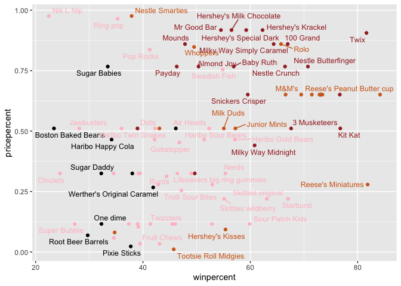
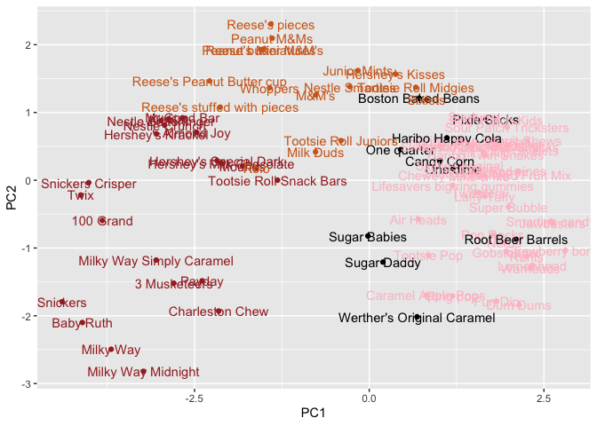
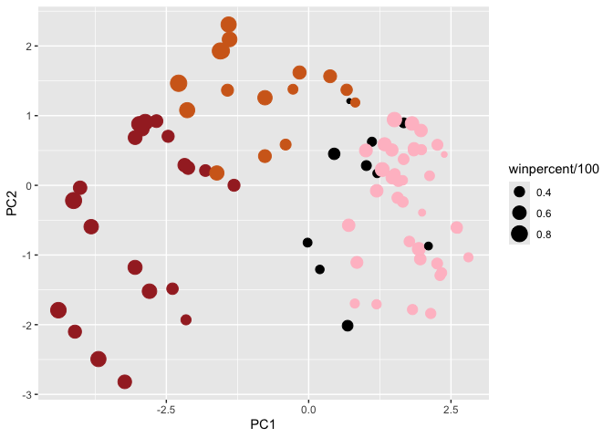

# BIMM 143 Lab 10
Ashley Martinez (PID: A17891957)

- [Candy Data](#candy-data)
- [Favorite Candy](#favorite-candy)
- [Overall Candy Rankings](#overall-candy-rankings)
- [Price Percent](#price-percent)
- [Correlation Structure](#correlation-structure)
- [Principal Component Analysis](#principal-component-analysis)

As it is nearly Halloween and the half way point in the quarter, let’s
do a mini project to help us figure out the best candy!

## Candy Data

Our data comes from the 538 website and is avaliable as a CSV file:

``` r
candy<- read.csv("candy-data.txt",row.names=1)
flextable::flextable(head(candy,10))
```


> Q1. How many different candy types are in this dataset?

**Answer**: 85

``` r
nrow(candy)
```

    [1] 85

``` r
candy|>
  nrow()
```

    [1] 85

``` r
library(tidyverse)
```

    ── Attaching core tidyverse packages ──────────────────────── tidyverse 2.0.0 ──
    ✔ dplyr     1.1.4     ✔ readr     2.1.5
    ✔ forcats   1.0.1     ✔ stringr   1.5.2
    ✔ ggplot2   4.0.0     ✔ tibble    3.3.0
    ✔ lubridate 1.9.4     ✔ tidyr     1.3.1
    ✔ purrr     1.1.0     
    ── Conflicts ────────────────────────────────────────── tidyverse_conflicts() ──
    ✖ dplyr::filter() masks stats::filter()
    ✖ dplyr::lag()    masks stats::lag()
    ℹ Use the conflicted package (<http://conflicted.r-lib.org/>) to force all conflicts to become errors

``` r
candy%>%
  nrow()
```

    [1] 85

> Q2. How many fruity candy types are in the dataset?

**Answer**: 38

``` r
sum(candy$fruity)
```

    [1] 38

## Favorite Candy

My favorite winpercent

``` r
candy["Twix",]$winpercent
```

    [1] 81.64291

``` r
candy["Kit Kat",]$winpercent
```

    [1] 76.7686

``` r
candy["Tootsie Roll Snack Bars",]$winpercent
```

    [1] 49.6535

> Q3. What is your favorite candy in the dataset and what is it’s
> winpercent value?

**Answer**: 81.64%

> Q4. What is the winpercent value for “Kit Kat”?

**Answer**: 76.77%

> Q5. What is the winpercent value for “Tootsie Roll Snack Bars”?

**Answer**: 49.65%

Here is an alternative way to calculate winpercent.

``` r
library(dplyr)

candy|>
  filter(rownames(candy)=="Twix") |>
  select(winpercent)
```

         winpercent
    Twix   81.64291

``` r
library("skimr")
skim(candy)
```

|                                                  |       |
|:-------------------------------------------------|:------|
| Name                                             | candy |
| Number of rows                                   | 85    |
| Number of columns                                | 12    |
| \_\_\_\_\_\_\_\_\_\_\_\_\_\_\_\_\_\_\_\_\_\_\_   |       |
| Column type frequency:                           |       |
| numeric                                          | 12    |
| \_\_\_\_\_\_\_\_\_\_\_\_\_\_\_\_\_\_\_\_\_\_\_\_ |       |
| Group variables                                  | None  |

Data summary

**Variable type: numeric**

| skim_variable | n_missing | complete_rate | mean | sd | p0 | p25 | p50 | p75 | p100 | hist |
|:---|---:|---:|---:|---:|---:|---:|---:|---:|---:|:---|
| chocolate | 0 | 1 | 0.44 | 0.50 | 0.00 | 0.00 | 0.00 | 1.00 | 1.00 | ▇▁▁▁▆ |
| fruity | 0 | 1 | 0.45 | 0.50 | 0.00 | 0.00 | 0.00 | 1.00 | 1.00 | ▇▁▁▁▆ |
| caramel | 0 | 1 | 0.16 | 0.37 | 0.00 | 0.00 | 0.00 | 0.00 | 1.00 | ▇▁▁▁▂ |
| peanutyalmondy | 0 | 1 | 0.16 | 0.37 | 0.00 | 0.00 | 0.00 | 0.00 | 1.00 | ▇▁▁▁▂ |
| nougat | 0 | 1 | 0.08 | 0.28 | 0.00 | 0.00 | 0.00 | 0.00 | 1.00 | ▇▁▁▁▁ |
| crispedricewafer | 0 | 1 | 0.08 | 0.28 | 0.00 | 0.00 | 0.00 | 0.00 | 1.00 | ▇▁▁▁▁ |
| hard | 0 | 1 | 0.18 | 0.38 | 0.00 | 0.00 | 0.00 | 0.00 | 1.00 | ▇▁▁▁▂ |
| bar | 0 | 1 | 0.25 | 0.43 | 0.00 | 0.00 | 0.00 | 0.00 | 1.00 | ▇▁▁▁▂ |
| pluribus | 0 | 1 | 0.52 | 0.50 | 0.00 | 0.00 | 1.00 | 1.00 | 1.00 | ▇▁▁▁▇ |
| sugarpercent | 0 | 1 | 0.48 | 0.28 | 0.01 | 0.22 | 0.47 | 0.73 | 0.99 | ▇▇▇▇▆ |
| pricepercent | 0 | 1 | 0.47 | 0.29 | 0.01 | 0.26 | 0.47 | 0.65 | 0.98 | ▇▇▇▇▆ |
| winpercent | 0 | 1 | 50.32 | 14.71 | 22.45 | 39.14 | 47.83 | 59.86 | 84.18 | ▃▇▆▅▂ |

> Q6. Is there any variable/column that looks to be on a different scale
> to the majority of the other columns in the dataset?

**Answer**: The winpercent row seems to be on a different scale because
all the other rows are on a scale from 0 to 1 while this row ranges from
around 14 to 84, it is on a 0-100 scale.

> Q7. What do you think a zero and one represent for the
> candy\$chocolate column?

**Answer**: The candy doesn’t contain chocolate if it is 0.

> Q8. Plot a histogram of winpercent values

``` r
library(ggplot2)

ggplot(candy)+
  aes(winpercent)+
  geom_histogram(bins=20)
```


> Q9. Is the distribution of winpercent values symmetrical?

**Answer**: The distribution is not symmetrical with the maximum skewed
to the left.

> Q10. Is the center of the distribution above or below 50%?

**Answer**: The center is below 50%.

``` r
mean(candy$winpercent)
```

    [1] 50.31676

``` r
summary(candy$winpercent)
```

       Min. 1st Qu.  Median    Mean 3rd Qu.    Max. 
      22.45   39.14   47.83   50.32   59.86   84.18 

> Q11. On average is chocolate candy higher or lower ranked than fruit
> candy?

**Answer**: Chocolate is higher ranked.

To do this:

\#1. Find all chocolate candy in the dataset

\#2. Find their winpercent values

\#3. Calculate the mean of these values

\#4-6. Do the same for fruity candy

\#7. Compare mean winspercents of chocolate vs. fruity

\#8. Pick the highest as the winner

``` r
choc.inds<-candy$chocolate==1
choc.win<-candy[choc.inds,]$winpercent
choc.mean<-mean(choc.win)
choc.mean
```

    [1] 60.92153

``` r
fruit.inds<-candy$fruity==1
fruit.win<-candy[fruit.inds,]$winpercent
fruit.mean<-mean(fruit.win)
fruit.mean
```

    [1] 44.11974

``` r
mean(candy[candy$fruity==1,]$winpercent)
```

    [1] 44.11974

> Q12. Is this difference statistically significant?

**Answer**: Yes, the p value is less than 0.05.

``` r
t.test(choc.win,fruit.win)
```


        Welch Two Sample t-test

    data:  choc.win and fruit.win
    t = 6.2582, df = 68.882, p-value = 2.871e-08
    alternative hypothesis: true difference in means is not equal to 0
    95 percent confidence interval:
     11.44563 22.15795
    sample estimates:
    mean of x mean of y 
     60.92153  44.11974 

## Overall Candy Rankings

> Q13. What are the five least liked candy types in this set?

**Answer**: Nik L Nip, Boston Baked Beans, Chiclets, Super Bubble, and
Jawbusters

``` r
candy|>
  arrange(winpercent)|>
  head(5)
```

                       chocolate fruity caramel peanutyalmondy nougat
    Nik L Nip                  0      1       0              0      0
    Boston Baked Beans         0      0       0              1      0
    Chiclets                   0      1       0              0      0
    Super Bubble               0      1       0              0      0
    Jawbusters                 0      1       0              0      0
                       crispedricewafer hard bar pluribus sugarpercent pricepercent
    Nik L Nip                         0    0   0        1        0.197        0.976
    Boston Baked Beans                0    0   0        1        0.313        0.511
    Chiclets                          0    0   0        1        0.046        0.325
    Super Bubble                      0    0   0        0        0.162        0.116
    Jawbusters                        0    1   0        1        0.093        0.511
                       winpercent
    Nik L Nip            22.44534
    Boston Baked Beans   23.41782
    Chiclets             24.52499
    Super Bubble         27.30386
    Jawbusters           28.12744

> Q14. What are the top 5 all time favorite candy types out of this set?

**Answer**: Snickers, Kit Kat, Twix, Reese’s Minatures, and Reese’s
Peanut Butter cup

``` r
candy|>
  arrange(winpercent)|>
  tail(5)
```

                              chocolate fruity caramel peanutyalmondy nougat
    Snickers                          1      0       1              1      1
    Kit Kat                           1      0       0              0      0
    Twix                              1      0       1              0      0
    Reese's Miniatures                1      0       0              1      0
    Reese's Peanut Butter cup         1      0       0              1      0
                              crispedricewafer hard bar pluribus sugarpercent
    Snickers                                 0    0   1        0        0.546
    Kit Kat                                  1    0   1        0        0.313
    Twix                                     1    0   1        0        0.546
    Reese's Miniatures                       0    0   0        0        0.034
    Reese's Peanut Butter cup                0    0   0        0        0.720
                              pricepercent winpercent
    Snickers                         0.651   76.67378
    Kit Kat                          0.511   76.76860
    Twix                             0.906   81.64291
    Reese's Miniatures               0.279   81.86626
    Reese's Peanut Butter cup        0.651   84.18029

> Q15. Make a first barplot of candy ranking based on winpercent values.

> Q16. This is quite ugly, use the reorder() function to get the bars
> sorted by winpercent?

``` r
library(ggplot2)

ggplot(candy) + 
  aes(winpercent, reorder(rownames(candy),winpercent)) +
  geom_col()
```


> Q17. What is the worst ranked chocolate candy?

**Answer**: Sixlets

> Q18. What is the best ranked fruity candy?

**Answer**: Starburst

``` r
my_cols<-rep("black", nrow(candy))
my_cols[as.logical(candy$chocolate)] = "chocolate"
my_cols[as.logical(candy$bar)] = "brown"
my_cols[as.logical(candy$fruity)] = "pink"

ggplot(candy) + 
  aes(winpercent, reorder(rownames(candy),winpercent)) +
  geom_col(fill=my_cols)
```


## Price Percent

``` r
library(ggrepel)
ggplot(candy) +
  aes(winpercent, pricepercent, label=rownames(candy)) +
  geom_point(col=my_cols) + 
  geom_text_repel(col=my_cols, size=3.3, max.overlaps = 7)
```

    Warning: ggrepel: 27 unlabeled data points (too many overlaps). Consider
    increasing max.overlaps



> Q19. Which candy type is the highest ranked in terms of winpercent for
> the least money - i.e. offers the most bang for your buck?

**Answer**: Reese’s Miniatures

> Q20. What are the top 5 most expensive candy types in the dataset and
> of these which is the least popular?

**Answer**: Nik L Nip, Nestle Smarties, ring pop, Hershey’s Krackel,
Hershey’s Milk Chocolate

``` r
ord <- order(candy$pricepercent, decreasing = TRUE)
head( candy[ord,c(11,12)], n=5 )
```

                             pricepercent winpercent
    Nik L Nip                       0.976   22.44534
    Nestle Smarties                 0.976   37.88719
    Ring pop                        0.965   35.29076
    Hershey's Krackel               0.918   62.28448
    Hershey's Milk Chocolate        0.918   56.49050

## Correlation Structure

``` r
library(corrplot)
```

    corrplot 0.95 loaded

``` r
cij<- cor(candy)
corrplot(cij)
```


> Q22. Examining this plot what two variables are anti-correlated
> (i.e. have minus values)?

**Answer**: Chocolate and fruity

> Q23. Similarly, what two variables are most positively correlated?

**Answer**: Chocolate and bar

## Principal Component Analysis

The function to use is called ‘prcomp()’ with an optional ‘scale=T/F’
argument.

``` r
pca<- prcomp(candy,scale=TRUE)
summary(pca)
```

    Importance of components:
                              PC1    PC2    PC3     PC4    PC5     PC6     PC7
    Standard deviation     2.0788 1.1378 1.1092 1.07533 0.9518 0.81923 0.81530
    Proportion of Variance 0.3601 0.1079 0.1025 0.09636 0.0755 0.05593 0.05539
    Cumulative Proportion  0.3601 0.4680 0.5705 0.66688 0.7424 0.79830 0.85369
                               PC8     PC9    PC10    PC11    PC12
    Standard deviation     0.74530 0.67824 0.62349 0.43974 0.39760
    Proportion of Variance 0.04629 0.03833 0.03239 0.01611 0.01317
    Cumulative Proportion  0.89998 0.93832 0.97071 0.98683 1.00000

Our main PCA result figure

``` r
ggplot(pca$x)+
  aes(PC1,PC2,label=rownames(pca$x))+
  geom_point(col=my_cols)+
  geom_text(col=my_cols)
```



We should also examine the variable “loadings” or contributions of the
original variable to the new PCs.

``` r
ggplot(pca$rotation)+
  aes(PC1,rownames(pca$rotation))+
  geom_col()
```


> Q24. What original variables are picked up strongly by PC1 in the
> positive direction? Do these make sense to you?

**Answer**: Pluribus, hard, and fruity. These make sense because these
tend to be the main trends for all fruity candy.

``` r
my_data <- cbind(candy, pca$x[,1:3])
p <- ggplot(my_data) + 
        aes(x=PC1, y=PC2, 
            size=winpercent/100,  
            text=rownames(my_data),
            label=rownames(my_data)) +
        geom_point(col=my_cols)

p
```



Interactive plots that can be zoomed on and “brushed” over can be made
with the **plotly** package. It’s output is interactive and will not
render to PDF.
