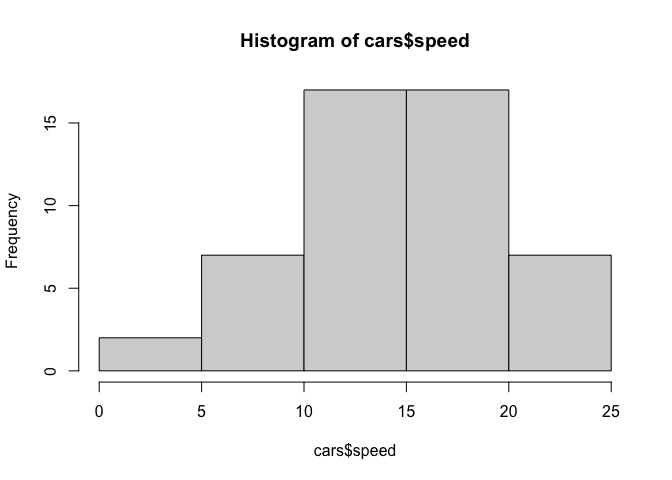
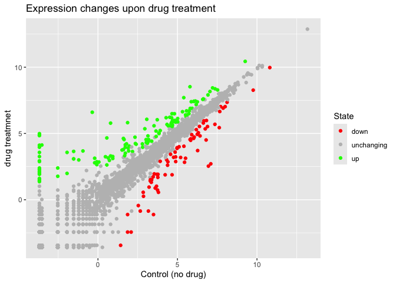
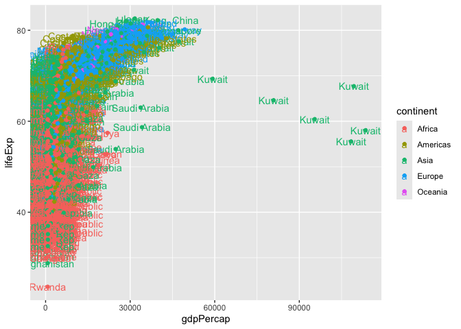

# Class 5: Data Visualization with GGPlot
Ashley (PID: A17891957)

Today we are exploring the **ggplot** package and how to make nice
figures in R.

There are lots of ways to make figures and plot in R. These include:

-so called “base” R -and add on packages like **ggplot2**

Here is a simple “base” R plot.

``` r
head(cars)
```

      speed dist
    1     4    2
    2     4   10
    3     7    4
    4     7   22
    5     8   16
    6     9   10

We can simply pass to the ‘plot()’ function.

``` r
plot(cars)
```


> Key-point: Base R is quick but not so nice and simple looking in some
> folks eyes.

Let’s see how we can plot this with **ggplot2**…

1st I need to install this add-on package. For this we use the
‘install.packages()’ function - **WE DO THIS IN THE CONSOLE, NOT our
report**. This is a one time only deal.

2nd we need to load the package with the ‘library()’ function every time
we want to use it.

``` r
library(ggplot2)
ggplot(cars)
```


Every ggplot is composed of at least three layers:

\-**data**(i.e. a data.frame with the things you want to plot),
-aesthetics **aes()** that map the columns of data to your plot features
(i.e. aesthetics) -geoms like **geom_point()** that srt how the plot
appears

``` r
ggplot(cars)+
  aes(x=speed,y=dist)+
  geom_point()
```


``` r
hist(cars$speed)
```



> Key point: For simple “canned” graphs base R is quicker but as things
> get more custom and elaborate then ggplot wins out…

Let’s add more layers to our ggplot

Add a line showing the relationship between x and y Add a title Add
custom axis labels “Speed (MPH)” and “Distance (ft)” Change the theme….

``` r
ggplot(cars)+
  aes(x=speed,y=dist)+
  geom_point()+
  geom_smooth(method="lm",se=FALSE)+
  labs(title="Silly plot of Speed vs Stopping distance",
       x="Speed (MPH)", 
       y="Distance (ft)") +
  theme_bw()
```

    `geom_smooth()` using formula = 'y ~ x'


## Going further

Read some gene expression data

``` r
url <- "https://bioboot.github.io/bimm143_S20/class-material/up_down_expression.txt"
genes <- read.delim(url)
head(genes)
```

            Gene Condition1 Condition2      State
    1      A4GNT -3.6808610 -3.4401355 unchanging
    2       AAAS  4.5479580  4.3864126 unchanging
    3      AASDH  3.7190695  3.4787276 unchanging
    4       AATF  5.0784720  5.0151916 unchanging
    5       AATK  0.4711421  0.5598642 unchanging
    6 AB015752.4 -3.6808610 -3.5921390 unchanging

> Q1. How many genes are in this dataset?

``` r
nrow(genes)
```

    [1] 5196

> Q2. How many “up” regulated genes are there?

``` r
sum(genes$State =="up")
```

    [1] 127

A useful funtion for counting up occurances of things in a vector is the
‘table()’ function.

``` r
table(genes$State)
```


          down unchanging         up 
            72       4997        127 

Make a v1 figured

``` r
p<-ggplot(genes)+
  aes(x=Condition1,
      y=Condition2,col=State)+
  geom_point()
```

``` r
p+
  scale_color_manual(values=c("red","gray","green"))+
  labs(title="Expression changes upon drug treatment",
       x="Control (no drug)",
       y="drug treatmnet")
```



## More Plotting example

Read in the gapminder mindset

``` r
# File location online
url <- "https://raw.githubusercontent.com/jennybc/gapminder/master/inst/extdata/gapminder.tsv"

gapminder <- read.delim(url)
```

Lets have a peek

``` r
head(gapminder,3)
```

          country continent year lifeExp      pop gdpPercap
    1 Afghanistan      Asia 1952  28.801  8425333  779.4453
    2 Afghanistan      Asia 1957  30.332  9240934  820.8530
    3 Afghanistan      Asia 1962  31.997 10267083  853.1007

``` r
tail(gapminder,3)
```

          country continent year lifeExp      pop gdpPercap
    1702 Zimbabwe    Africa 1997  46.809 11404948  792.4500
    1703 Zimbabwe    Africa 2002  39.989 11926563  672.0386
    1704 Zimbabwe    Africa 2007  43.487 12311143  469.7093

> Q.4 How many diffeent country values are in this dataset?

``` r
nrow(gapminder)
```

    [1] 1704

``` r
length(table(gapminder$country))
```

    [1] 142

> Q5. How many different continent values are in this dataset?

``` r
length(table(gapminder$continent))
```

    [1] 5

``` r
unique(gapminder$continent)
```

    [1] "Asia"     "Europe"   "Africa"   "Americas" "Oceania" 

``` r
ggplot(gapminder)+
  aes(x=gdpPercap,y=lifeExp,col=continent)+
  geom_point()
```


``` r
ggplot(gapminder)+
  aes(x=gdpPercap,y=lifeExp,col=continent,label=country)+
  geom_text()+
  geom_point()
```



``` r
library(ggrepel)
```

``` r
ggplot(gapminder)+
  aes(x=gdpPercap,y=lifeExp,col=continent,label=country)+
  geom_point()+
  facet_wrap(~continent)
```


I can use the **ggrepel** package to make more sensible labels here.

I want a seperate pannel per continent.

ggplot2 offers several advantages over base R plots:

1.  **Layered grammar**: ggplot2 builds plots by adding layers (data,
    aesthetics, geoms), making complex visualizations easier to
    construct and modify step-by-step
    [\[1\]](https://drive.google.com/file/d/1BYSWJLROqxA1YpuDhJkzUolhiZqiOOKg/view?usp=drivesdk),
    [\[2\]](https://drive.google.com/file/d/1tFqKg9_nhVMmKYfiM1CQKDS2PmPwLh8n/view?usp=drivesdk),
    [\[3\]](https://drive.google.com/file/d/1Clw2_EJ_hY3USNwObiPnxpIQIfirxfW0/view?usp=drivesdk),
    [\[4\]](https://drive.google.com/file/d/1FDBbIi2Rlw2In9mClB7Mub8oUPgx6y8h/view?usp=drivesdk).
2.  **Consistency**: The same syntax and logic apply across different
    plot types, reducing the need to learn new functions for each
    visualization
    [\[1\]](https://drive.google.com/file/d/1BYSWJLROqxA1YpuDhJkzUolhiZqiOOKg/view?usp=drivesdk),
    [\[2\]](https://drive.google.com/file/d/1tFqKg9_nhVMmKYfiM1CQKDS2PmPwLh8n/view?usp=drivesdk),
    [\[3\]](https://drive.google.com/file/d/1Clw2_EJ_hY3USNwObiPnxpIQIfirxfW0/view?usp=drivesdk),
    [\[4\]](https://drive.google.com/file/d/1FDBbIi2Rlw2In9mClB7Mub8oUPgx6y8h/view?usp=drivesdk).
3.  **Publication quality**: ggplot2 produces attractive, professional
    figures with sensible defaults, which are often more visually
    appealing than base R plots
    [\[1\]](https://drive.google.com/file/d/1BYSWJLROqxA1YpuDhJkzUolhiZqiOOKg/view?usp=drivesdk),
    [\[2\]](https://drive.google.com/file/d/1tFqKg9_nhVMmKYfiM1CQKDS2PmPwLh8n/view?usp=drivesdk),
    [\[3\]](https://drive.google.com/file/d/1Clw2_EJ_hY3USNwObiPnxpIQIfirxfW0/view?usp=drivesdk),
    [\[4\]](https://drive.google.com/file/d/1FDBbIi2Rlw2In9mClB7Mub8oUPgx6y8h/view?usp=drivesdk).
4.  **Customization**: It is easier to customize legends, colors,
    themes, and other elements, especially for complex plots
    [\[1\]](https://drive.google.com/file/d/1BYSWJLROqxA1YpuDhJkzUolhiZqiOOKg/view?usp=drivesdk),
    [\[2\]](https://drive.google.com/file/d/1tFqKg9_nhVMmKYfiM1CQKDS2PmPwLh8n/view?usp=drivesdk),
    [\[3\]](https://drive.google.com/file/d/1Clw2_EJ_hY3USNwObiPnxpIQIfirxfW0/view?usp=drivesdk).
5.  **Scalability**: ggplot2 handles large datasets and complex plots
    more efficiently, and code can be reused and automated for
    reproducibility
    [\[1\]](https://drive.google.com/file/d/1BYSWJLROqxA1YpuDhJkzUolhiZqiOOKg/view?usp=drivesdk),
    [\[2\]](https://drive.google.com/file/d/1tFqKg9_nhVMmKYfiM1CQKDS2PmPwLh8n/view?usp=drivesdk),
    [\[3\]](https://drive.google.com/file/d/1Clw2_EJ_hY3USNwObiPnxpIQIfirxfW0/view?usp=drivesdk).
6.  **Community and resources**: Extensive documentation, cheat sheets,
    and examples are available, making it easier to learn and
    troubleshoot
    [\[2\]](https://drive.google.com/file/d/1tFqKg9_nhVMmKYfiM1CQKDS2PmPwLh8n/view?usp=drivesdk),
    [\[3\]](https://drive.google.com/file/d/1Clw2_EJ_hY3USNwObiPnxpIQIfirxfW0/view?usp=drivesdk),
    [\[4\]](https://drive.google.com/file/d/1FDBbIi2Rlw2In9mClB7Mub8oUPgx6y8h/view?usp=drivesdk).

Base R plots are quick for simple, exploratory graphics, but ggplot2
excels for refined, layered, and publication-ready figures
[\[1\]](https://drive.google.com/file/d/1BYSWJLROqxA1YpuDhJkzUolhiZqiOOKg/view?usp=drivesdk),
[\[2\]](https://drive.google.com/file/d/1tFqKg9_nhVMmKYfiM1CQKDS2PmPwLh8n/view?usp=drivesdk),
[\[3\]](https://drive.google.com/file/d/1Clw2_EJ_hY3USNwObiPnxpIQIfirxfW0/view?usp=drivesdk),
[\[4\]](https://drive.google.com/file/d/1FDBbIi2Rlw2In9mClB7Mub8oUPgx6y8h/view?usp=drivesdk).
What aspect do you want to explore further?
